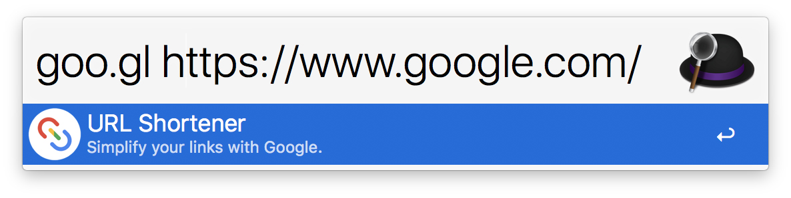

# Alfred-URL-Shortener

## Introduction

* This workflow for [Alfred 3](https://www.alfredapp.com/) allows you to shorten URL with _Google URL Shortener API_.

## Usage

* Download the Workflow from [here](https://github.com/hwyncho/Alfred-URL-Shortener/releases).

* The Workflow has a keyword `goo.gl`.

* You can shorten URLs with `goo.gl [URL to shorten]`.

* The shortened URL is copied to the clipboard.
